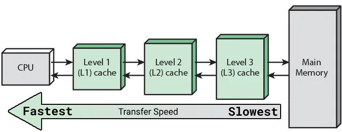

# Lesson 8 Prepare: User/Kernel Threads and Computer Architecture

Section | Content
--- | ---
1   | [Overview](#overview)
2.1 | [User and Kernel Threads](#user-and-kernel-threads) :key: 
2.2 | [User and Kernel Threads Simplified](#user-and-kernel-threads-simplified)
2.3 | [Relation Between User and Kernel Threads](#relation-between-user-and-kernel-threads)
3   | [Computer Architecture](#computer-architecture) :key:
4.1 | [Cache Coherence](#cache-coherence) :key: 
4.2 | [Cache Coherence Simplified](#cache-coherence-simplified)
5.1 | [Recursion](#recursion)
5.2 | [Recursion Resources](#recursion-resources)

:key: = Vital concepts that we will continue to build on in coming lessons / key learning outcomes for this course.

### Overview

In this lesson we will explore in greater detail what is happening at the hardware level of your computer when you are building parallel and concurrent applications. You may want to start with reviewing this Wikipedia [article about Threads](https://en.wikipedia.org/wiki/Thread_(computing)) in computing.

### User and Kernel Threads

There are two types of threads: User threads and Kernel threads.

- User threads are managed by the programmer or by the operating system's runtime environment (e.g., the Global Interpreter Lock (GIL) in Python). They are lightweight and can be created and destroyed quickly. However, they are not directly scheduled by the operating system kernel, so their performance can be unpredictable.
- Kernel threads are managed by the operating system kernel. They are heavyweight and more expensive to create and destroy than user threads. However, they are directly scheduled by the kernel, so their performance is more predictable.

User space is where user programs run, while kernel space is where the operating system kernel runs. In order for a user program to do something interesting, such as print to a screen or open a file, it must make a system call. A system call is a function call that traps into the kernel space.

When we say *traps into the kernel* this is what we are referring to:

When a user program makes a system call, it triggers a software interrupt that causes the processor to temporarily switch from executing user-space instructions to executing kernel-space instructions. This allows the kernel to execute the requested system call and then return control to the user program.

You can not create or delete kernel threads. Each OS has a *kernel* or core, and kernel threads do not match the number of CPUs on a computer; the number of these threads can be high.

As a reminder, all threads must run in a process. A process is a program that is loaded into memory and is running on an operating system. Each process has its own address space and resource allocation.

Here is a diagram that illustrates the relationship between threads, processes, user space, and kernel space:

**NOTE:** This section was summarized from various sources but primarily Tutorials Point's [OS Multi Thread](https://www.tutorialspoint.com/operating_system/os_multi_threading.htm) post.

### User and Kernel Threads Simplified

Here is an analogy that may help you understand/remember this concept easier:

> Imagine that you are a customer at a restaurant. You can order food and drinks from the menu, but you cannot go into the kitchen to cook your own meal. The kitchen is analogous to the kernel space, and the restaurant dining area is analogous to the user space.
>
> When you want to order a meal, you have to flag down a waiter or waitress. The waiter or waitress is analogous to a system call. They take your order and then go into the kitchen to have it prepared. Once your meal is ready, the waiter or waitress brings it back to you.
>
> (Bard AI)

### Relation Between User and Kernel Threads

When you start a program on a computer, the OS will load that program into memory (now called a process at this point), and assign some kernel threads to that process. Kernel threads are the threads that run on CPUs. There are a number of different user/kernel relationships that can be followed by the OS

**Many-to-Many**

The many-to-many model multiplexes any number of user threads onto an equal or smaller number of kernel threads.

The following diagram shows the many-to-many threading model where 6 user level threads are multiplexing with 6 kernel level threads. In this model, developers can create as many user threads as necessary and the corresponding Kernel threads can run in parallel on a multiprocessor machine. This model provides the best accuracy on concurrency and when a thread performs a blocking system call, the kernel can schedule another thread for execution

**Many-to-One**

Many-to-one model maps many user level threads to one Kernel-level thread. Thread management is done in user space by the thread library. When thread makes a blocking system call, the entire process will be blocked. Only one thread can access the Kernel at a time, so multiple threads are unable to run in parallel on multiprocessors.

If the user-level thread libraries are implemented in the operating system in such a way that the system does not support them, then the Kernel threads use the many-to-one relationship modes.

**One-to-One**

There is one-to-one relationship of user-level thread to the kernel-level thread. This model provides more concurrency than the many-to-one model. It also allows another thread to run when a thread makes a blocking system call. It supports multiple threads to execute in parallel on microprocessors.

Disadvantage of this model is that creating user thread requires the corresponding Kernel thread. OS/2, windows NT and windows 2000 use one to one relationship model.

### Computer Architecture

To better understand what is happening in your programs let us quickly review key parts of a computer:

**Motherboard (Circuit Board)**

The motherboard in a printed circuit board that contains the central processing unit (CPU), memory, and other essential components of a computer.

**The Bus**

Bus lines on the motherboard are what connect components so they can communicate with each other. Bus lines are wires that carry data or signals between the different parts of the computer. Bus lines are high-speed internal connections.

**CPU Cache**

> A CPU cache is a hardware cache used by the central processing unit (CPU) of a computer to reduce the average cost (time or energy) to access data from the main memory. A cache is a smaller, faster memory, located closer to a processor core, which stores copies of the data from frequently used main memory locations. Most CPUs have a hierarchy of multiple cache levels (L1, L2, often L3, and rarely even L4), with separate instruction-specific and data-specific caches at level 1.
>
> ([Quote Source](https://en.wikipedia.org/wiki/CPU_cache))

For a more in depth explanation of the CPU cache you should watch this Techquickie video: [What is CPU Cache?](https://www.youtube.com/watch?v=sHqNMHf2UNI)

**Cache Levels**

In CPUs today, all three levels are found on the CPU.

The cache memory connects to the motherboard bus.

In this image, you can see that each core of a CPU has their own L1 and L2 cache. The larger L3 cache is shared between cores.

**CPUs**

Here are comparisons between the Intel i3, i5, i7 and i9 CPUs, or brains, of the computer. Keep in mind Intel is only one brand and type of CPU architecture. Notice the differences in cache sizes:

### Cache Coherence

Modern CPUs run so fast that the time it takes to get data from the hard disk or even RAM, creates a slowdown in it's processing capabilities. The cache levels discussed in the last section improve/solve this problem by storing data closer to, or even on, the CPU. This however introduces a new problem that needs to be managed: [Cache Coherence](https://en.wikipedia.org/wiki/Cache_coherence).

> Cache coherence refers to the consistency and synchronization of data stored in different caches within a multiprocessor or multi-core system
>
> ([Redis - Cache Coherence](https://redis.com/glossary/cache-coherence/)).

Cache Coherence protocols are designed to ensure that all processors have a consistent view of shared data. This can require additional steps to be taken, such as invalidating or updating other processors' caches, which can add overhead to the execution of the program.

The amount of slowdown caused by cache coherence can vary depending on a number of factors, including the cache coherence protocol being used, the frequency of cache misses, and the amount of shared data. In some cases, the slowdown can be negligible, but in other cases it can be significant.

Here are some of the reasons why cache coherence can cause a slowdown:

- **Cache misses**: When a processor needs to access a piece of data that is not in its cache, it must first fetch the data from main memory. This can take several hundreds of cycles, which can significantly slow down the execution of the program.
- **Cache invalidations**: When a processor writes to a piece of data that is cached by other processors, those processors' caches must be invalidated. This means that the cached copies of the data are marked as invalid, and the processors must fetch the data from main memory again if they need to access it in the future.
- **Cache updates**: In some cache coherence protocols, processors may need to update their caches with the latest version of a shared data item. This can involve sending messages to other processors, which can add overhead to the execution of the program.

Cache Coherence is a necessary evil in multithreaded programming. It is essential for ensuring that all processors have a consistent view of shared data, but it can also cause a slowdown in some cases. The amount of slowdown can be mitigated by using a carefully chosen cache coherence protocol and by minimizing the amount of shared data.

### Cache Coherence Simplified

Imagine you and your friends are planning to go out to a movie. Each of you has a different version of the plan, with some having the correct theater location, some the correct movie time, and others the correct movie title. This inconsistency in information represents `cache misses` in a computer system, where data in one cache doesn't match the main memory, causing a slowdown as the CPU needs to fetch the correct data.

`Cache coherence` is like the mechanism that ensures everyone has the same consistent information about the movie night. It synchronizes the theater location, movie time, and movie title (data) across all processors, just like aligning the details of the movie night among your friends. When one friend (processor) updates the movie night information, such as changing the theater location, they notify the others, ensuring everyone has the latest version. This process prevents confusion and errors, similar to having everyone agree on the final plan for the movie night in a group chat and minimizing `cache invalidations`; a friend with incorrect details about the movie night.

### Recursion

We will be using recursion for the next few assignments.

> In computer science, recursion is a method of solving a problem where the solution depends on solutions to smaller instances of the same problem. Such problems can generally be solved by iteration, but this needs to identify and index the smaller instances at programming time. Recursion solves such recursive problems by using functions that call themselves from within their own code. The approach can be applied to many types of problems, and recursion is one of the central ideas of computer science.

(Image from [Skilled.dev Recursion Course](https://skilled.dev/course/recursion))

Please keep in mind that recursion by itself will not inherently introduce cache coherence issues, but the way you implement recursion in your programs and how data is accessed within a recursive function can potentially impact cache performance greatly.

We will explore this concept in greater detail in class. For now, please familiarize yourself with the concept of recursion and how it *looks* on the system. The image above for example shows recursion in action, and the image below shows the state of the call stack for this recursion.

(Image from Code Academy [CSJS 22 Recursion Cheatsheet](https://www.codecademy.com/learn/cscj-22-basic-algorithms/modules/cscj-22-recursion/cheatsheet))

### Recursion Resources

If you need help understanding recursion or need to refresh your memory on how it works, please review these links:

- [Recursion (computer science)](https://en.wikipedia.org/wiki/Recursion_\(computer_science\))
- [Recursion in Python](https://realpython.com/python-thinking-recursively/#recursive-functions-in-python)
- [Understanding Recursion](https://stackabuse.com/understanding-recursive-functions-with-python/)
- [Video on Recursion](https://www.youtube.com/watch?v=ngCos392W4w)
- [What on Earth is Recursion? - Computerphile](https://www.youtube.com/watch?v=Mv9NEXX1VHc)